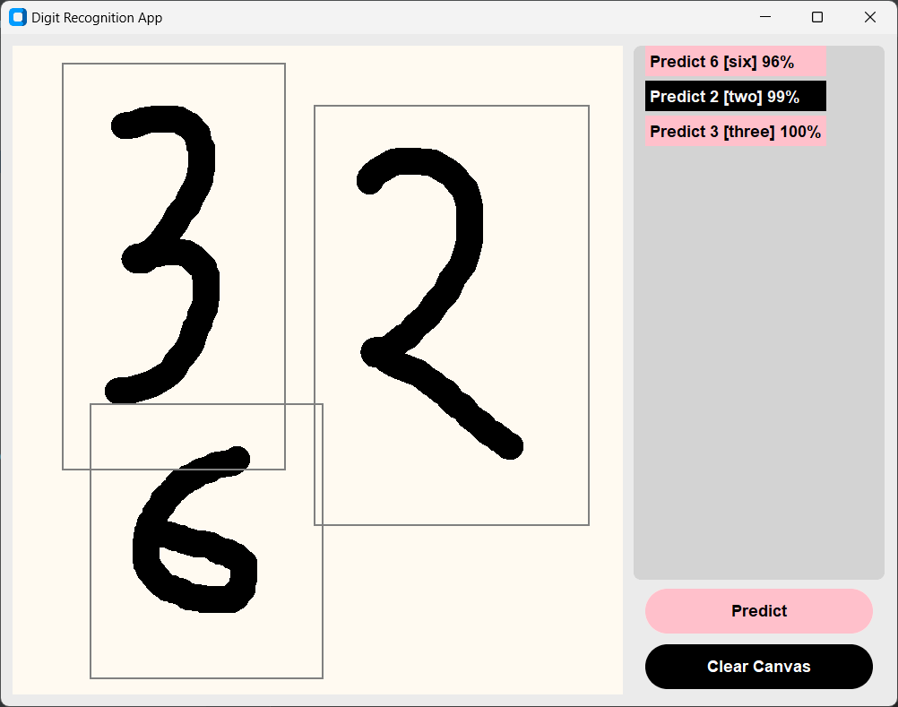

# ✋🖌️ HandDrawnDigitAI

Welcome to **HandDrawnDigitAI** – an intuitive app for recognizing hand-drawn digits! Powered by **CustomTkinter**, a pre-trained **Convolutional Neural Network (CNN)**, and a user-friendly **GUI**, this project brings machine learning right to your fingertips. Draw digits, recognize them instantly, and enjoy the seamless experience!

---

## 🗂️ Project Structure

```plaintext
HandDrawnDigitAI/
│
├── app/
│   ├── __init__.py              # Makes `app` a package
│   ├── gui.py                   # Contains the GUI logic
│   ├── digit_recognizer.py      # Logic for recognizing digits
│   ├── themes.py                # Themes dictionary
│   └── utils.py                 # Helper utility functions
│
├── models/
│   └── cnn_model.h5             # Pre-trained model
│
├── logs/                        # Stores temporary image files
│
├── notebooks/
│   └── cnn_mnist.ipynb          # Notebook for model
│
├── run.py                       # Main entry point to the app
├── requirements.txt             # Dependencies for the project
└── README.md                    # Documentation
```
---

## 🚀 Features

- 🖼️ **Interactive Drawing Canvas**  
  Use the mouse to draw digits directly on the canvas.

- 🧠 **AI-Powered Digit Recognition**  
  Recognize digits (0-9) using a **pre-trained CNN model** trained on the **MNIST dataset**.

- 🎨 **Dynamic Themes**  
  Choose from multiple visually appealing themes:  
  🔵 *Oceanic* | 🌙 *Dark Mode* | 🎨 *Vibrant* | 🖤 *Corporate* | 🌸 *Pink Black*

- 🛠️ **Modular Codebase**  
  Clean and organized project structure for easy navigation.

---

## 🎯 How It Works

1. **Draw a digit** on the canvas.  
2. **Press the "Predict" button**, and the model will recognize the digit.  
3. If the prediction isn't clear, **adjust and re-draw** on the canvas!  
4. Use the **"Clear Canvas" button** to start over.

---

## 📋 Requirements

Make sure you have the following dependencies installed before running the app:

```plaintext
tensorflow==2.10.0
customtkinter==5.1.2
pillow==9.2.0
numpy==1.23.0
opencv-python==4.6.0
```

#### Install them using:
```
pip install -r requirements.txt
```

---

## 📂 Files & Directories
### 📁 app/
- **gui.py**  
  Handles the graphical user interface logic, including button interactions and canvas drawing.

- **digit_recognizer.py**  
  Preprocesses the canvas image and uses the CNN model for predictions.

- **themes.py**  
  Stores theme configurations for a visually appealing UI.

- **utils.py**  
  Helper functions to support digit recognition and GUI.
  
### 📁 models/
- **cnn_model.h5**  
  Pre-trained CNN model saved in Keras HDF5 format.

### 📁 logs/
- Temporary directory to store canvas snapshots during runtime.

### 📁 notebooks/
- **cnn_mnist.ipynb**  
  A Jupyter Notebook used to train the CNN model on the MNIST dataset.

### `run.py`
- The main entry point to launch the application.

---

## 🖥️ Running the Application
Follow these steps to get started:

1. Clone the repository:

```
git clone https://github.com/asRot0/HandDrawnDigitAI.git
cd HandDrawnDigitAI
```

2. Install the required dependencies:

```
pip install -r requirements.txt
```
3. Run the app:

```
python run.py
```
4. Draw digits and enjoy the magic! ✨

---
## 🎨 Themes Preview

| 🌙 Dark Mode | 🔵 Oceanic | 🌸 Pink Black |
|:------------:|:----------:|:-------------:|
|  |  |  |


### 🌸 *`BlackPink`* Theme


---

## 📖 Model Training (Optional)
If you'd like to retrain the model:

1. Open the Jupyter Notebook in the `notebooks`/ directory.
2. Train the CNN on the MNIST dataset.
3. Save the updated model as cnn_model.h5 in the models/ directory.

## 💡 Future Enhancements
- ✍️ Add support for multiple languages.
- 📊 Integrate visualization of model predictions (e.g., activation maps).
- 🔄 Real-time digit recognition with camera input.

---

## 🌟 Contributors
- Asif Ahmed – [GitHub](https://github.com/asRot0/)  
Creator and Maintainer

Want to contribute? Feel free to fork the repository and open a pull request!

## 🤝 Support
If you find this project helpful, consider giving it a ⭐ on [GitHub](https://github.com/asRot0/HandDrawnDigitAI) and sharing it with others!

---